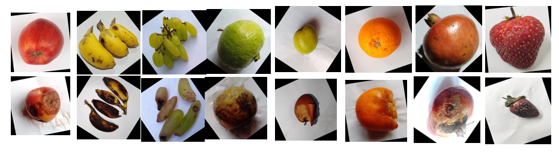
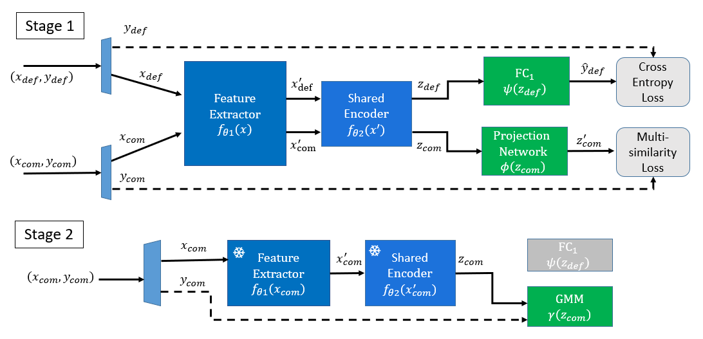

#  DeepGD3_Plus

We present our code on PCB Dataset and Fruit Dataset in two folder. Please go into the links below for more information.

## Dataset

[**PCB Dataset**](https://github.com/jason211346/Phison-defect-detection-YWL/tree/main/Phison_dataset) |  [**Fruit Dataset**](https://github.com/jason211346/Phison-defect-detection-YWL/tree/main/Fruit_dataset)
:-------------------------:|:-------------------------:
 |  

## Challenge

Defect detection is a common task in deep learning and is widely used in industrial image analysis. In practical applications, we define components with sufficient normal and defective samples as "old components", while components with insufficient defective samples or even a complete lack of defective samples as "new components". The defect types for both new and old components are the same, as shown in the table below. 

|         | Normal Samples | Defective Samples |
|---------|----------------|------------------|
| Old Component | Many           | Many             |
| New Component | Many           | Few or even none |

We found that general models perform poorly in detecting defects in new components. Therefore, we started to study how to design a model architecture that can better generalize defect features using only defective samples from old components when there is a lack of defective samples for new components in the dataset. The goal is to further improve the ability to detect defects in new components.

## Model architecture

- **Hybrid Expert:**



## Key technology
- **Imblanced sample in Component:**
- [x] Class Balanced Sampling : Class Balanced Sampling can keep the original data distribution and sample the same number of instances for each class during each sampling iteration. This can avoid model bias caused by imbalanced samples.
- **Defect Detector:**
- [x] CrossEntropy : Use CrossEntropy as the loss function for the defect detector.
- **Component Embedding:**
- [x] Multi-Similarity Loss : Multi-Similarity Loss can effectively learn the similarity between components and embed them into a high-dimensional vector space

## Requirement
```
# Python 3.8: https://tech.serhatteker.com/post/2019-12/upgrade-python38-on-ubuntu/
pip install -U scikit-learn
pip install tensorboard tensorboardX selenium twder beautifulsoup4 seaborn thop tqdm pytorch_metric_learning openpyxl natsort tensorboard_logger opencv-python pandas seaborn numpy
pip install torch==1.11.0+cu113 torchvision==0.12.0+cu113 torchaudio==0.11.0 --extra-index-url https://download.pytorch.org/whl/cu113
pip install bayesian-optimization==1.4.2
pip install pycave==3.1.3
pip install ipykernel --upgrade
python3 -m ipykernel install --user
```