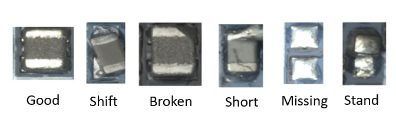

# Phison-defect-detection-YWL

## Dataset

[**PCB Dataset**](https://github.com/jason211346/Phison-defect-detection-YWL/tree/main/Phison_dataset) |  [**Fruit dataset**](https://github.com/jason211346/Phison-defect-detection-YWL/tree/main/Fruit_dataset)
:-------------------------:|:-------------------------:
 |  


## Requirement
```
# 將Python升級到3.8: https://tech.serhatteker.com/post/2019-12/upgrade-python38-on-ubuntu/
pip install -U scikit-learn
pip install tensorboard tensorboardX selenium twder beautifulsoup4 seaborn thop tqdm pytorch_metric_learning openpyxl natsort tensorboard_logger opencv-python pandas seaborn numpy
pip install torch==1.11.0+cu113 torchvision==0.12.0+cu113 torchaudio==0.11.0 --extra-index-url https://download.pytorch.org/whl/cu113
pip install bayesian-optimization==1.4.2
pip install pycave==3.1.3
pip install ipykernel --upgrade
python3 -m ipykernel install --user
```

## Key technology
- **Imblanced sample in Component:**
- [x] Class Balanced Sampling
- **Defect Detector:**
- [x] CrossEntropy
- **Component Embedding:**
- [x] Multi-Similarity Loss

- **Inference:**
- [x] Expert 1 with NN classifier
- [x] Expert 2 with GMM
